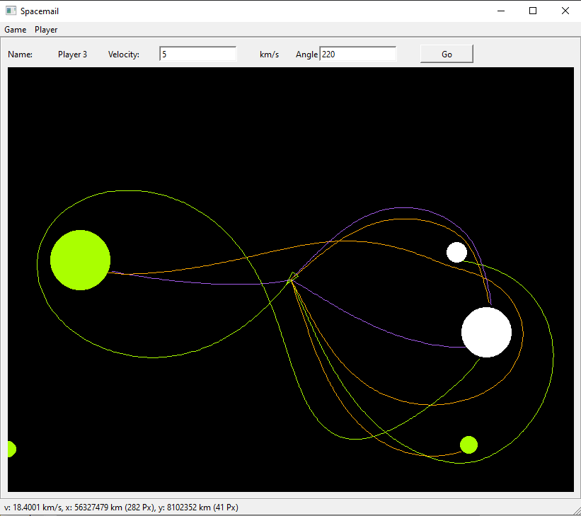

# Spacemail

Hierbei handelt es sich um ein Weltraumspiel. Ziel ist es eine Nachricht vom Mutterschiff mit Hilfe eines Landeschiffs auf einen oder mehreren Planeten (je nach Spielmodus) zu bringen. Das Schiff wird dabei mit einer vom Spielenden gewählten Startgeschwindigkeit und einem Startwinkel vom Mutterschiff gestartet. Anschließend bewegt sich das Schiff nur noch unter Einfluss der Gravitation der Planeten. Größere Planeten haben eine größere Masse und damit auch einen größeren gravitativen Einfluss auf das Schiff. Die Planeten sind dabei ortsfest.

Es können zwischen einem und 10 Spielende spielen. Die Spielenden sind nacheinander an der Reihe. Wer als erstes seinen bzw. ihren oder alle Zielplaneten (je nach Spielmodus) erreicht hat, gewinnt.

Es gibt folgende Spielmodi:
1. Gleicher Planet: Alle Spielenden müssen den gleichen Planeten erreichen.
2. Verschiedene Planeten: Alle Spielenden müssen einen, aber möglicherweise anderen Planeten erreichen.
3. Alle Planeten: Alle Planeten müssen in beliebiger Reihenfolge erreicht werden.

Die noch zu erreichenden Planeten haben die Farbe des Spielenden.

## Installation und Ausführung
Das Programm wurde auf Windows 10 geschrieben und getestet. Zur Installation wird der Ordner Spacemail heruntergeladen und auf dem PC gespeichert. Danach kann das Programm mit einem Doppelklick auf Spacemail.exe gestartet werden.

Der Quellcode befindet sich im Ordner SourceCode.

## Physik
Es wurde das newtonsche Gravitationsgesetz verwendet. Die Planeten bleiben ortsfest, nur das Landeschiff bewegt sich. Die entstehende Differentialgleichung wird numerisch mit dem expliziten Eulerverfahren gelöst. Das explizite Eulerverfahren ist sicherlich nicht das beste Verfahren, aber es liefert realistische Trajektorien, die für das Spiel genau genug sind.

## Threading
Die Simulation kann jederzeit mit einem Button unterbrochen werden. Wird die Simulation unterbrochen, ist der Spielzug in dem Moment vorbei und der nächste Spielende ist an der Reihe. Um ein Einfrieren des Hauptfensters zu verhindern, wird die Simulation in einem eigenen Thread gestartet. Auch das Zeichnen findet in einem separaten Thread statt. Da sowohl die Simulation, als auch der Stift zum Zeichnen gleichzeitig auf die Trajektorie zugreifen muss, wird die aktuelle Position des Raumschiffs durch einen Mutex geschützt. So kann verhindert werden, dass sich zwischen dem Einlesen der x- und y-Komponente der aktuellen Position durch den zeichnenden Stift die y-Komponente durch neuere Simulationsergebnisse ändert. 

## Screenshot

Ein drei Spieler Spiel im Modus allPlanets.

Der grüne Spieler ist an der Reihe und muss noch die (Drei) grünen Planeten treffen.

Copyright (C) 2024 Michael